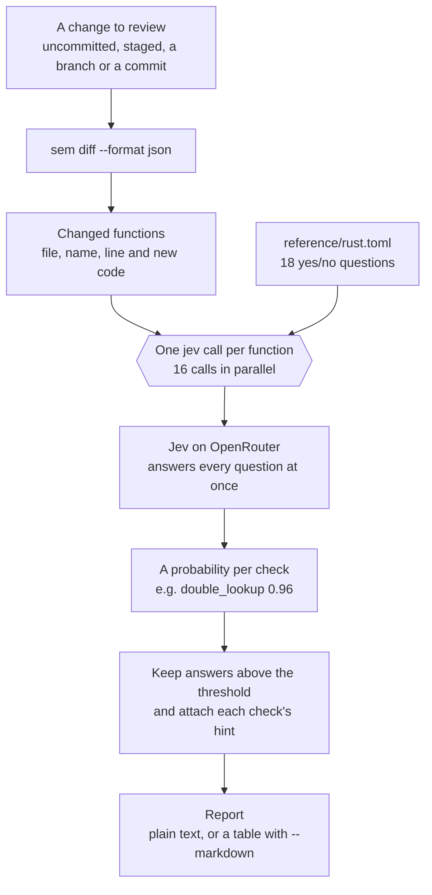

# jev-review

Code review for the issues the Rust compiler doesn't catch: clones that could be borrows, `unwrap` on
input that can fail, errors dropped without a word, accidental O(n²) loops, locks held across slow
work, `as` casts that silently truncate, floats used for money, and more.

It combines two tools:

- **[sem](https://github.com/Ataraxy-Labs/sem)** finds which functions a diff added or changed, and
  gives each one's new code.
- **[fuzzy-jev](https://github.com/dsaad68/fuzzy-jev)** (the `jev` command) asks Jev, TypeSafe's
  model on OpenRouter's decisions endpoint, a fixed set of yes/no questions about each function and
  returns a probability per question instead of prose.

Every changed function is reviewed against 18 checks in one call, 16 calls at a time. A typical
change takes about a second and costs a fraction of a cent: the demo below reviews 14 functions for
$0.0023 (at OpenRouter's prices in October 2026; costs here are what fuzzy-jev reported at the time).

```text
no_cow.rs:37  load
  0.96  double_lookup       Use the entry API instead of looking the key up twice
  0.86  silent_error        Report or count errors instead of silently dropping them

main.rs:1  last_word
  0.93  unsigned_underflow  Guard the unsigned subtraction (checked_sub / saturating_sub)
```

## How it works



Each function is sent on its own, so findings point at a specific function and a slow or failed
call only affects that one; failed calls are retried three times and then listed separately. All
18 questions go in the same call, and Jev answers them independently, so adding a check costs a
few tokens rather than another call.

## Quick start

You need `bash`, `git` and `jq`, plus:

```sh
brew install sem-cli             # sem; see https://github.com/Ataraxy-Labs/sem for other installs
cargo install fuzzy-jev          # fuzzy-jev 0.6 or later, which provides the `jev` command
export OPENROUTER_API_KEY=...    # an OpenRouter API key
```

Check the setup without spending anything: `sem --version`, `jev --version`, and
`jev --dry-run -q .claude/skills/jev-review/reference/rust.toml 'x' > /dev/null`.

> **Your code leaves your machine.** The source of every changed function is sent to OpenRouter and
> the model behind it. Don't run this on code you aren't allowed to share with them.

```sh
S=.claude/skills/jev-review/script/review.sh
$S                                   # review uncommitted changes
$S -- --staged                       # staged changes
$S -- --from main --to HEAD          # a branch
$S --markdown -o review.md -- --from main
$S -t 0.7                            # only findings above 0.7
```

Run it from inside the repository you want to review. Plain text goes to stdout; `--markdown` prints
a table instead, for a PR comment or a file. A summary line (findings, cost, time) goes to stderr.
`-h` lists every option.

To see it work on a change with known issues, run the demo:

```sh
rust-example/demo/run.sh
```

It commits five files to a throwaway repository, applies a change with ten planted issues and two
clean edits (listed in [`demo/planted.tsv`](rust-example/demo/planted.tsv)), and reviews it.

### As a skill for AI agents

[`.claude/skills/jev-review/`](.claude/skills/jev-review/) is a Claude Code skill. With this
repository's `.claude/` folder in place, an agent asked to review a change runs the script and reads
the results. Its [`SKILL.md`](.claude/skills/jev-review/SKILL.md) tells the agent to treat findings
as leads to confirm in the code, not as verdicts, and lists the known false positives.

## The checks

All 18 are in [`reference/rust.toml`](.claude/skills/jev-review/reference/rust.toml). Each question
says what counts *and what doesn't*, because near misses are where checks like these go wrong.

| Check | Flags code that… |
| --- | --- |
| `cow` | copies its input on a path where it is returned unchanged, so it could return `Cow` |
| `slice_param` | takes `&String`, `&Vec<T>`, `&PathBuf` or `&Box<T>` where `&str`, `&[T]`, `&Path` or `&T` would do |
| `needless_clone` | clones something that could be borrowed or moved |
| `unwrap` | panics with `unwrap`/`expect` on a failure the caller could handle |
| `needless_collect` | collects into a `Vec` or `String` only to use it once |
| `quadratic` | does accidental O(n²) work, such as `Vec::contains` or `remove(0)` in a loop |
| `lock_scope` | holds a `Mutex`/`RwLock` across I/O, sleeps, channel calls or other locks |
| `silent_error` | throws errors away with `let _ =`, `.ok()` or a default |
| `stringly_typed` | uses strings or magic numbers for a fixed set of states |
| `boolean_trap` | has calls like `render(&page, true, false)` |
| `index_loop` | loops over `0..v.len()` and indexes where an iterator would do |
| `manual_reimpl` | hand-writes a loop that a std method like `sum`, `max_by_key` or `retain` already does |
| `double_lookup` | looks up the same map key twice where the `entry` API does it once |
| `lossy_cast` | narrows numbers with `as` on values that can be out of range |
| `unsigned_underflow` | subtracts unsigned numbers that can go negative |
| `float_misuse` | compares computed floats with `==` or stores money as `f64` |
| `rc_cycle` | builds `Rc`/`Arc` cycles without `Weak` |
| `string_errors` | returns `Result<_, String>` from reusable functions |

### Writing your own questions

A questions file can be TOML or JSON; fuzzy-jev reads both. TOML is easier to read and edit, and it
allows comments. Each question is a `[[question]]` table:

```toml
# hint: Use the entry API instead of looking the key up twice
[[question]]
name = "double_lookup"
type = "noul"
instruction = "Does this Rust code look up the same key in a map twice where the entry API would do?"

[question.criteria]
true = "The same key is searched twice in a row (contains_key + get/insert)"
false = "Map updates use the entry API, or the lookups are for different keys"
```

The same question in JSON:

```json
{
  "double_lookup": {
    "type": "noul",
    "instructions": "Does this Rust code look up the same key in a map twice where the entry API would do?",
    "criteria": {
      "true": "The same key is searched twice in a row (contains_key + get/insert)",
      "false": "Map updates use the entry API, or the lookups are for different keys"
    }
  }
}
```

Note the differences: TOML uses `name` and `instruction` (singular), JSON uses the id as the key and
`instructions`. fuzzy-jev rejects keys it doesn't know, so the review script reads two TOML comments
instead:

- `# ext: .rs`: which changed files the questions apply to.
- `# hint: <text>`, on the line before a question: the suggestion shown when the answer is yes.

A JSON file has no comments, so findings show the check id instead of a hint, and every changed file
is reviewed unless you pass `-e .rs`.

To use your own file, pass it with `-q`, or put it in the skill's `reference/` folder as
`<lang>.toml` and pass `-l <lang>`. That is also how to add a language: copy `rust.toml`, change its
`# ext:` line and questions. Check a file for free before using it, since a dry run makes no call:

```sh
jev --dry-run -q my-questions.toml 'x' > /dev/null
```

## How well it works

Measured on 206 labelled Rust files in [`rust-example/examples/`](rust-example/examples/): small,
medium and large programs, ten per check (36 for `cow`), written so that half of each check's
examples have the issue and half are near misses that don't. A finding counts as a yes above 0.5.

The first six checks are scored on all 206 files. The other twelve are scored on the 120 files
written for them, which are labelled for all 18 checks, so each check is also tested against the
other checks' examples.

| Check | Files with / without the issue | Correct | Of its yes answers, right | Of real issues, found | AUC |
| --- | --- | --- | --- | --- | --- |
| `cow` | 18 / 188 | 100% | 95% | 100% | 0.999 |
| `slice_param` | 6 / 200 | 100% | 100% | 83% | 1.000 |
| `needless_clone` | 8 / 198 | 95% | 38% | 62% | 0.918 |
| `unwrap` | 5 / 201 | 99% | 67% | 80% | 0.983 |
| `needless_collect` | 6 / 200 | 96% | 42% | 83% | 0.944 |
| `quadratic` | 5 / 201 | 99% | 71% | 100% | 0.998 |
| `lock_scope` | 5 / 115 | 99% | 100% | 80% | 0.995 |
| `silent_error` | 5 / 115 | 98% | 71% | 100% | 1.000 |
| `stringly_typed` | 5 / 115 | 99% | 83% | 100% | 1.000 |
| `boolean_trap` | 5 / 115 | 100% | 100% | 100% | 1.000 |
| `index_loop` | 5 / 115 | 100% | 100% | 100% | 1.000 |
| `manual_reimpl` | 5 / 115 | 98% | 67% | 80% | 0.994 |
| `double_lookup` | 5 / 115 | 98% | 75% | 60% | 0.995 |
| `lossy_cast` | 5 / 115 | 98% | 71% | 100% | 1.000 |
| `unsigned_underflow` | 5 / 115 | 99% | 100% | 80% | 0.998 |
| `float_misuse` | 5 / 115 | 99% | 100% | 80% | 1.000 |
| `rc_cycle` | 5 / 115 | 99% | 100% | 80% | 1.000 |
| `string_errors` | 5 / 115 | 100% | 100% | 100% | 1.000 |

AUC is how well the scores rank files with the issue above files without it (1.0 is perfect). With
only five files with the issue per check, one miss moves "found" by 20 points, so read the AUC and
the misses ([`results/v4.tsv`](rust-example/results/v4.tsv)) rather than the percentages alone.
Most checks rank almost perfectly but some real issues score just under 0.5; `needless_clone` and
`needless_collect` raise the most false alarms. In the demo, all ten planted issues are found above
0.5.

Things to know before relying on it:

- **Each function is judged on its own.** Jev doesn't see callers or type definitions, so issues
  that depend on context score lower even when real: `lossy_cast` and `lock_scope` came in at
  0.56–0.67 in the demo. Callers also inherit their callees' findings.
- **`unwrap` fires on lock, join and channel-send unwraps**, which its question excludes.
- **`needless_clone` overlaps with `cow`**: a `clone()` on a return path trips both.
- **These are leads, not verdicts.** Use it to comment on PRs, not to block merges. Confirm a
  finding in the code before acting on it.
- **The test set is optimistic.** The examples were written and labelled from the same definitions
  the questions use. Real code is messier; label some of your own before trusting the numbers.

## Repository layout

```text
.claude/skills/
  jev-review/          the review skill: SKILL.md, script/review.sh, reference/rust.toml
  jev/, sem/           skills for the two underlying tools
.agents/skills/        the same skills, for agents that read .agents/
rust-example/
  questions/           every version of the checks: v1-cow, v2-cow (Cow only), v3 (6 checks), v4 (18)
  examples/<check>/    labelled examples, one folder per check, with labels.tsv
  demo/                before/ and after/ files, planted.tsv and run.sh
  results/             the scores behind the numbers above
  eval.py              scores a questions file against the labelled examples
```

To reproduce the table, or to test changes to a questions file (needs Python 3.11 or later):

```sh
python3 rust-example/eval.py rust-example/questions/v4.toml
```

It asks every question about all 206 files (about $0.04 for v4), prints the scores per check and the
files it got wrong, and writes `results/<name>.tsv`.

### How the questions got here

- **v1** asked only whether code could use `Cow`. It said yes too easily: on files where `Cow` would
  not help, its average score was 0.44.
- **v2** narrowed the wording to "Cow fixes it, not some other change". The average on those files
  fell to 0.24, and accuracy at 0.5 went from 28/36 to 34/36.
- **v3** added five checks with ten labelled examples each.
- **v4** added twelve more, with ten labelled examples each, and was also tested on a planted
  diff (`demo/`).

[`results/v1-v2-cow.tsv`](rust-example/results/v1-v2-cow.tsv) has the per-file scores for the
first two.
